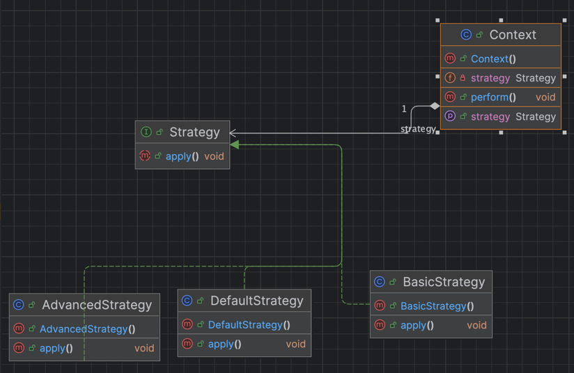
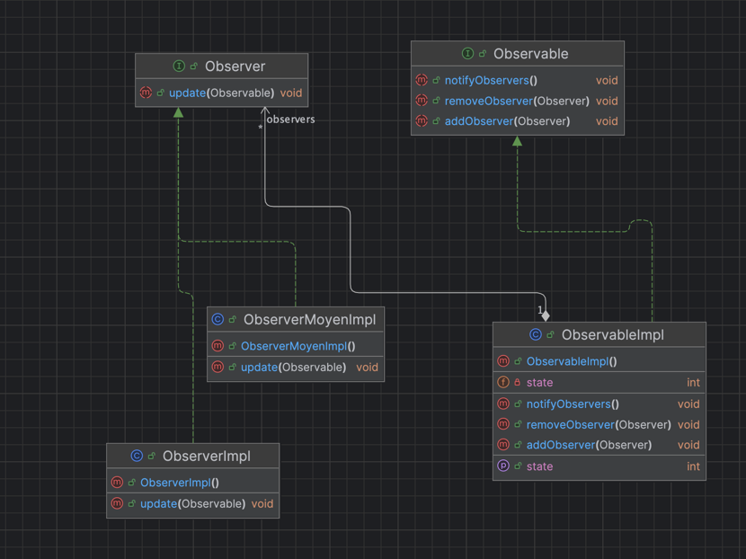
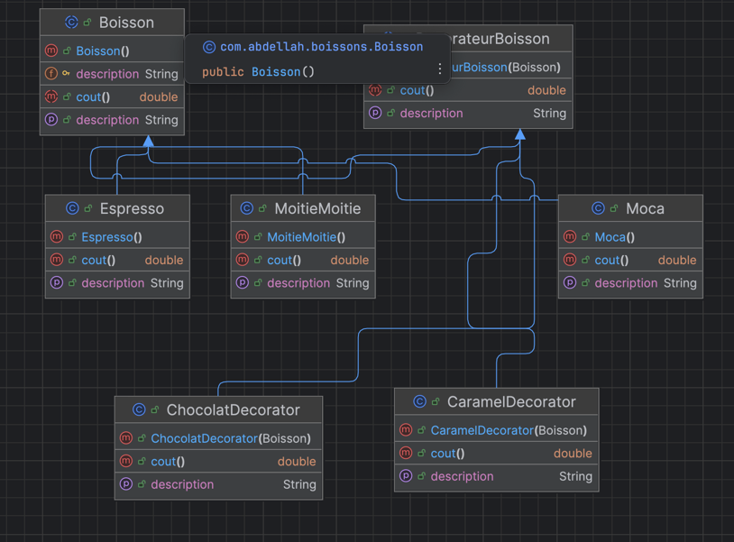
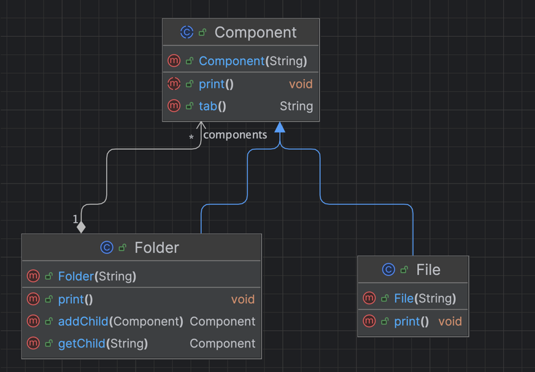

# DESIGN_PATTERNS

# 🧠 Design Pattern : Strategy

## 🔷 1. Définition

Le **Strategy Pattern** permet de **définir une famille d’algorithmes**, de **les encapsuler dans des classes distinctes**, et de **les rendre interchangeables** au sein d’un même contexte.

> Il permet à un objet de changer son **comportement dynamiquement**.

---

# 🧠 Design Pattern : Observer

## 🔷 1. Définition

Le **pattern Observer** définit **une relation de dépendance un-à-plusieurs** entre des objets :

> Lorsqu’un objet **change d’état**, tous ses **observateurs sont notifiés automatiquement** et **mis à jour**.

> C’est une implémentation du **principe de publication/abonnement** (*publish/subscribe*).

---

# 🧱 Design Pattern : Decorator

## 🔷 1. Définition

Le **Decorator Pattern** permet **d’ajouter des responsabilités supplémentaires à un objet** de manière flexible et dynamique, **sans modifier son code source**.

> Il suit le principe : **“ouvert à l’extension, fermé à la modification”**

---

# 🌲 Design Pattern : Composite

## 🔷 1. Définition

Le **Composite Pattern** permet de **composer des objets en structures arborescentes** pour représenter des **hiérarchies de type tout/partie**.

> Il permet à l’utilisateur de **traiter de manière uniforme** les **objets simples (feuilles)** et **composés (composites)**.

